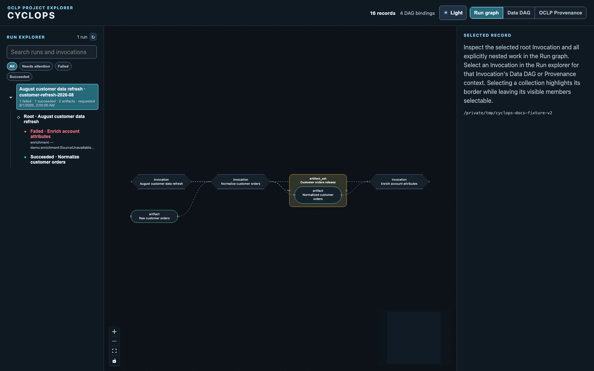
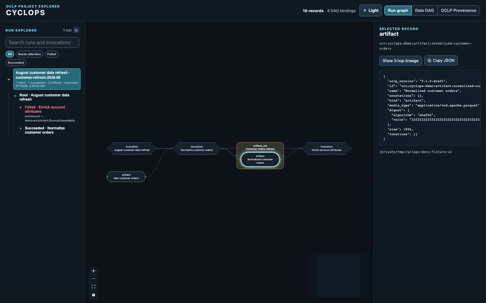
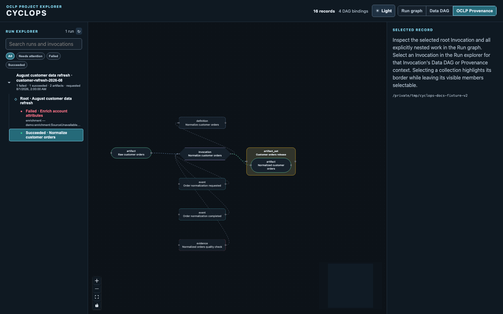
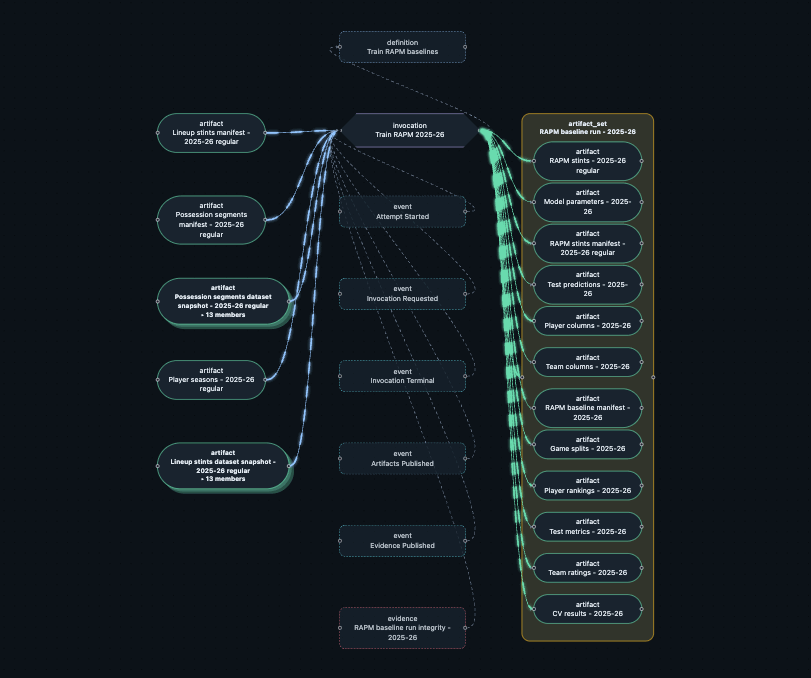
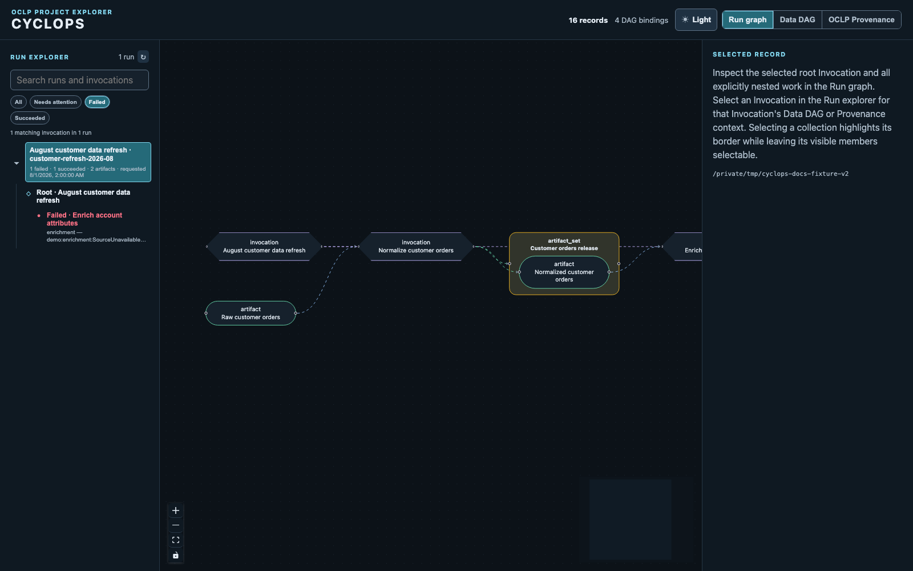

# Tour Cyclops

Cyclops reads an existing local OCLP store and projects its immutable records
into a navigable run lineage. The images below use a small generic customer-data
refresh: one nested task succeeds, one fails, and the successful task publishes
a named release.

## Start from the run

The Lineage explorer is the starting point. It groups real Executions that
claim the same lifecycle-profile `run_id`; legacy stores fall back to an
explicit parent-Execution hierarchy. Separate lifecycle runs join one lineage
only when an explicit produced-and-consumed Artifact handoff connects them. The
default **Run lineage** shows the selected connected lifecycle and all its
work. Solid animated edges carry data; no controller Execution is invented for
run navigation. It does not link unrelated runs simply because they share an
unproduced input.

An ArtifactSet starts as one collapsed collection node. Its layered backplates,
member count, and expand chevron make the hidden members visible as a concept
without showing them individually. Double-click it to reveal its unshared
member Artifacts inside a containing box, and double-click again to collapse
them. It organizes a published collection without replacing the underlying
Artifact records or adding a new execution step.

Use **Export GIF** in the toolbar to download a short loop of the complete
current graph scope. Cyclops fits that scope for capture, then restores your
working viewport. It is useful for explaining a run in a document or issue
without making the read-only explorer mutate the OCLP store.

You can drag nodes into a more useful arrangement. The placement lasts only in
the current browser session and graph scope. **Auto-arrange** restores a
collision-aware layered layout for the visible non-Timeline graph. In Timeline,
nodes move vertically only: their horizontal position remains pinned to their
immutable timestamp.

## Inspect the durable record

Select any node to inspect the immutable OCLP JSON that Cyclops read from the
local store. The detail panel keeps the record's kind and ID visible, exposes a
focused lineage view, and provides a **Copy JSON** action for troubleshooting,
tests, or downstream tooling.

## Add provenance when needed

Select a task, then choose **Show provenance context** in its record inspector.
The focused Data DAG stays in place while Cyclops adds the Computation, required
Events, Evidence, and other non-dataflow context recorded for that Execution. Events
and Evidence form a chronological timeline using their Core timestamps (and
Event sequence when timestamps tie), while the Computation stays as contextual
metadata.

Here is the same idea in an exported dogfood provenance graph. The bright,
flowing edges are direct Data DAG bindings; the quiet dashed edges add
Computation, Event, and Evidence context without claiming those records are
inputs or outputs of the computation.

Provenance context follows the explorer selection: choosing a lifecycle run
shows the Events and Evidence for all of its Executions, while choosing one
Execution narrows the overlay to that computation.

## Follow a run through time

Choose **Data DAG** for only the strict `Artifact → Execution → Artifact`
flow of the selected Execution. Choose **Timeline** to arrange that same
selection on an absolute UTC time axis. Select the lifecycle run to view all of its
work, or a child Execution to inspect just that computation. Each visible
Execution has a lane, while its Events and Evidence are ordered left-to-right
using their Core timestamps and Event sequence. Adaptive grid lines scale from
seconds to days as the time span grows. Direct inputs and outputs remain
visible: an Artifact with immutable `created_at` appears at that asserted time,
while an input without it appears in an **Untimed inputs** column before the
axis. Their original Data DAG edges remain visible without inventing a date.
Event timestamps still describe publication and other execution chronology.

## Find work that needs attention

Use the search box or status filters in the Lineage explorer to narrow its
navigation tree. A failed Execution is shown in red, with the portable OCLP
Diagnostic from its terminal Event beneath its label. The graph itself remains
the selected run; filtering never changes OCLP records or silently discards
their context.

See [Using Cyclops](using-cyclops.md) for the local startup command, graph
semantics, refresh behavior, and API details.
